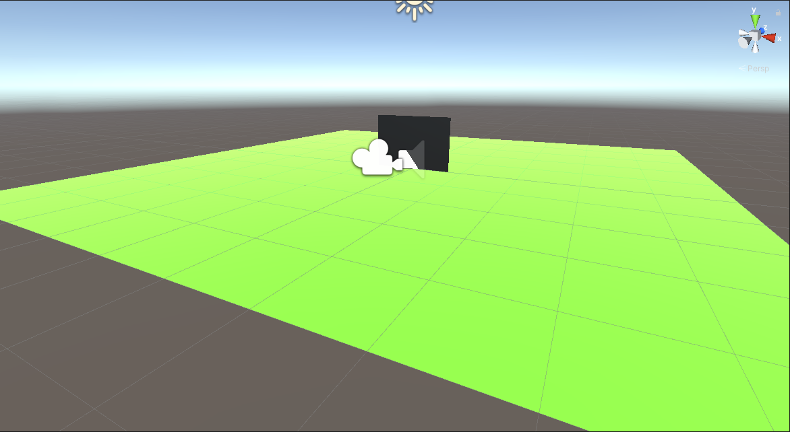
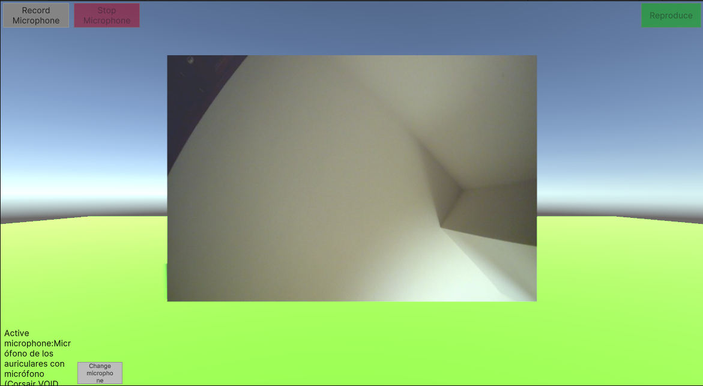

## Práctica 3 Delegados, Eventos

Marcos Jesús Barrios Lorenzo

alu0101056944

### Funcionamiento



Un plano a modo de suelo contiene otro plano más pequeño sobre el que se renderiza la salida de la webcam en tiempo real. Nada más ejecutarse se activa la webcam predeterminada. La interfaz contiene un botón para grabar audio del micrófono al pulsarlo, otro para dejar de grabar el micrófono y un último para reproducir la última grabación de audio del micrófono. **No se realizó la parte opcional de parar y/o reanudar el video de la webcam**. Se puede cambiar el micrófono a utilizar mediante otro botón, que muestra una lista donde se puede elegir el micrófono.

Para implementar la GUI no se utilizó el sistema tradicional de Unity UI sino el sistema más reciente, también totalmente integrado de manera oficial, UI Toolkit. Debido a ello la forma en la que se interactúa con la interfaz es distinta a la habitual. Es por ello que la parte lógica de la interfaz se ha implementado completamente por scripts. En concreto cada botón invoca el método [Button.RegisterCallback()](https://docs.unity3d.com/ScriptReference/UIElements.CallbackEventHandler.RegisterCallback.html) que invoca a su vez el callback pasado como argumento [cada vez que el EventDispatcher lo proceda](https://docs.unity3d.com/ScriptReference/UIElements.EventDispatcher.html). 

Se ha utilizado la UI Builder de Unity UI Toolkit para construir la interfaz. El uso de UI Toolkit requirió la descarga de los paquetes <code>com.unity.ui</code>, <code>com.unity.ui.builder</code> y la inclusión de sentencias <code>using UnityEngine.UIElements;</code> en los scripts.



En total se han utilizado tres scripts. El primero, [src/CaptureCamera.cs](src/CaptureCamera.cs) se encarga de renderizar la cámara en el material del plano pequeño. Para ello crea un [WebCamTexture](https://docs.unity3d.com/ScriptReference/WebCamTexture.html) y lo asigna a la propiedad material del renderer. Después, [src/UIMicrophoneController.cs](src/UIMicrophoneController.cs), que está en un objeto vacío con un componente AudioSource, obtiene referencias a los botones encargados de grabar, dejar de grabar y reproducir sonidos del micrófono. Esas referencias son utilizadas para asignarles callbacks por [Button.RegisterCallback()](https://docs.unity3d.com/ScriptReference/UIElements.CallbackEventHandler.RegisterCallback.html). El callback de grabar utiliza <code>Microphone.Start()</code>, el de dejar de grabar utiliza <code>Microphone.End()</code> y finalmente el de reproducir invoca al [AudioSource](https://docs.unity3d.com/ScriptReference/AudioSource.html) para que reproduzca el sonido.

Finalmente, se agregó un script [src/UIDeviceSelector.cs](src/UIDeviceSelector.cs) al objeto encargado de la GUI para implementar la funcionalidad que permita elegir el micrófono a utilizar. Se toma ventaja de que los métodos de Microphone sean estáticos. Su funcionamiento consiste en obtener acceso a los elementos de la UI, asignar un callback al botón que muestra la lista de micrófonos y otro callback para las etiquetas que contiene esa lista, de forma que cada vez que se clickee se cambie una variable estática con el nombre del micrófono activo. El objetivo es que esa variable sea utilizada por el resto de scripts para saber qué micrófono utilizar.


---

### Sobre el acceso por script a elementos de la UI

Para la UI se ha elegido UIToolkit, una alternativa oficial a la tradicional UnityUI. Utiliza árboles con elementos visuales que forman una jerarquía y ofrece la posibilidad de modificar el estilo mediante ficheros USS, parecidos a CSS.

Su uso ha requerido importar los paquetes <code>com.unity.ui</code> y <code>com.unity.ui.builder</code>, éste último para conseguir el editor UIBuilder. Una vez instalado se puede trabajar con todo lo que ofrece UIToolkit en los scripts, cuya clase principal es [Unity API: VisualElement](https://docs.unity3d.com/ScriptReference/UIElements.VisualElement.html), que permite modificar el estilo visual, el layout y utilizar eventos. Todos los elementos de UI son de tipo VisualElement.

El acceso a los elementos del visual tree ([Unity Manual: Visual tree](https://docs.unity3d.com/Manual/UIE-VisualTree.html)) puede resultar confuso. Primero se necesita una referencia al elemento visual raíz (rootVisualElement) contenido en el [UIDocument](https://docs.unity3d.com/Packages/com.unity.ui@1.0/api/UnityEngine.UIElements.UIDocument.html), que es el componente necesario para la UI en UIToolkit y que conecta elementos visuales con GameObjects. 

```c#
  var rootVisualElement = GetComponent<UIDocument>().rootVisualElement;
```

Con esa referencia se puede acceder a cualquier elemento visual en el visual tree y que en esta práctica utilizado para acceder al método [VisualElement.Q<>](https://docs.unity3d.com/Packages/com.unity.ui@1.0/api/UnityEngine.UIElements.UQueryExtensions.html#UnityEngine_UIElements_UQueryExtensions_Q__1_UnityEngine_UIElements_VisualElement_System_String_System_String___).

```c#
  var playButton = rootVisualElement.Q<Button>("play-button");
```

 El método permite hacer una consulta pasando el nombre del elemento visual a encontrar. Su funcionamiento consiste en llamar a <code>Query<T>.Build().First()</code>, que utiliza un objeto fábrica para construir un [QueryState](https://docs.unity3d.com/Packages/com.unity.ui@1.0/api/UnityEngine.UIElements.UQueryState-1.html) con las reglas de selección de la consulta. Sobre éste se puede llamar al método [First()](https://docs.unity3d.com/Packages/com.unity.ui@1.0/api/UnityEngine.UIElements.UQueryState-1.html#UnityEngine_UIElements_UQueryState_1_First) que devuelve el primer <code>VisualElement</code> que cumple los criterios que almacena.

 En este caso se consultan los elementos visuales <code>Button</code> que tienen en su propiedad <code>name</code> el string "play-button". **Nota: la propiedad** <code>name</code> **solo está presente en los <code>VisualElement</code> extendidos por el paquete** <code>com.unity.ui</code> **y, por lo tanto, no aparece en la API de Unity. Ver [UIToolkit API: VisualElement.name](https://docs.unity3d.com/Packages/com.unity.ui@1.0/api/UnityEngine.UIElements.VisualElement.html#UnityEngine_UIElements_VisualElement_name)**